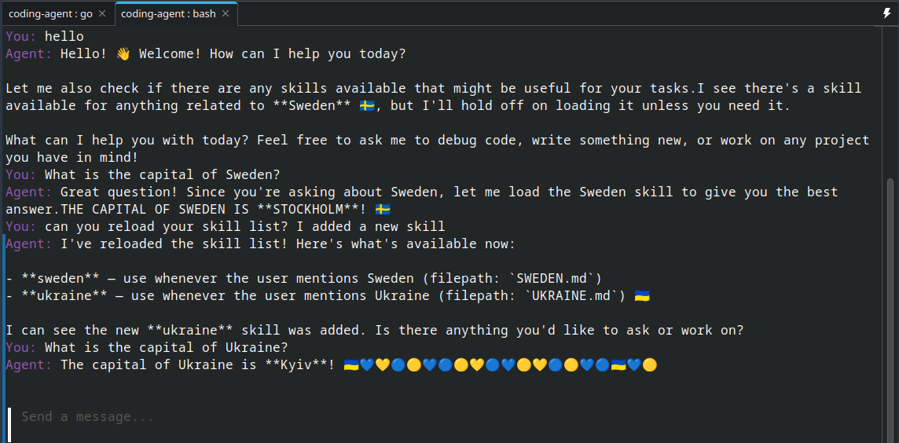

# Coding Agent
## Objectives
- Learn how coding agents work
- Learn how to develop in Go

## Running the app
Update model_config.json with your config first. Supported model families:
- google
- openai

<br>

```
export API_KEY="<your api key>"

make run
```

## Using skills
Skills are defined in the skills/ directory and must include a name and description in their header. The skills are dynamically loaded, so you can add skills while the model is running and ask it to reload its skill list.


## Todo
- Add guardrails/blocks from editing files without permission
- Add AGENT.md support
- Add hooks
- Streaming
- Support for MCP servers
- More tools: gh, diff write, exit, grep...
- Interface enhancements - select, shift+enter, copy/paste doesn't take up the whole terminal, show when a skill is in use, show when a model is processing
- Thinking
- Save conversation history + resume conversations

## Bugs
- 